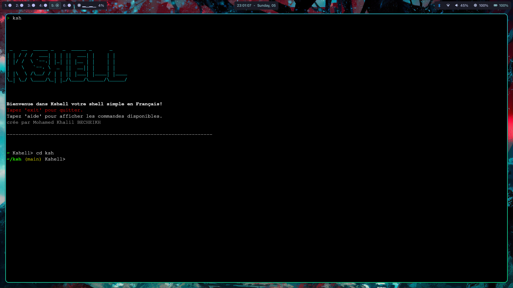

# Kshell — `ksh`

> Un interpréteur de commandes interactif et modulaire écrit en Python.


---

## Table des matières

- [Introduction](#Introduction)
- [Fonctionnalités](#fonctionnalités)
- [Architecture](#architecture)
- [Installation](#installation)
- [Utilisation](#utilisation)
- [Désinstallation](#désinstallation)
- [Sources](#sources)
- [Auteur](#auteur)

---

## Introduction




Kshell est un shell Unix minimaliste écrit from scratch en Python. Il exécute des commandes système, gère des pipelines, et expose ses propres builtins en français.

Créé pour comprendre ce qui se passe sous le capot d'un terminal : gestion de processus, appels système, gestion du `$PATH` — avec un réflexe DevOps dès la livraison (script d'install automatisé).

---

## Fonctionnalités

| Feature | Description |
|---|---|
|  **Exécution de commandes** | Lance n'importe quelle commande du `$PATH` |
|  **Pipelines** | Chaînage via `\|`, compatible avec les commandes externes |
|  **Builtins** | `cd`, `pwd`, `exit`, `alias`, `unalias`, `aide` |
|  **Alias persistants** | Sauvegardés dans `~/.ksh_aliases`, rechargés à chaque session |
|  **Autocomplétion Tab** | Commandes et chemins de fichiers/dossiers |
|  **Prompt dynamique** | Répertoire courant + branche Git en couleurs ANSI |
|  **Aide intégrée** | `aide` ou `aide <commande>` — documentation en français |

---

## Architecture

```
ksh/
├── main.py          # Boucle  principale
├── parser.py        # Découpe la saisie en tokens, détecte les pipes
├── executor.py      # Résout et lance : alias → builtin → commande externe
├── my_builtins.py   # gestion des commandes Built-in
├── completer.py     # Autocomplétion Tab via readline
├── prompt.py        # Prompt coloré avec branche Git
├── aliases.py       # Chargement et persistance des alias (JSON)
├── welcome.py       # Écran d'accueil (pyfiglet)
├── install.sh       # Script d'installation
└── uninstall.sh     # Script de désinstallation
```

---

## Installation

```bash
git clone https://github.com/Khalil-bec/ksh.git
cd ksh
chmod +x install.sh
./install.sh
```

`install.sh` vérifie Python 3.8+, installe `pyfiglet` et `colorama`, crée `~/.ksh_aliases` et dépose un lanceur dans `/usr/local/bin/ksh`.

---

## Utilisation

```bash
ksh
```

```bash
# Alias persistant
~/projets/ksh (main)> alias ll=ls -la
Alias 'll' créé → 'ls -la'

# Pipeline
~/projets/ksh (main)> aide | grep alias

# Aide
~/projets/ksh (main)> aide cd
```

---

## Désinstallation

```bash
chmod +x uninstall.sh
bash uninstall.sh
```

Supprime le lanceur et le retire de `/etc/shells`. Les alias dans `~/.ksh_aliases` sont conservés.

---

## Sources

- [`os`](https://docs.python.org/3/library/os.html)
- [`subprocess`](https://docs.python.org/3/library/subprocess.html)
- [`readline`](https://docs.python.org/3/library/readline.html)

---

## Auteur

**Mohamed Khalil BECHEIKH**  
Étudiant en informatique  — UPPA  
Passionné par la culture DevOps et l'ingénierie système.

[](https://github.com/Khalil-bec)